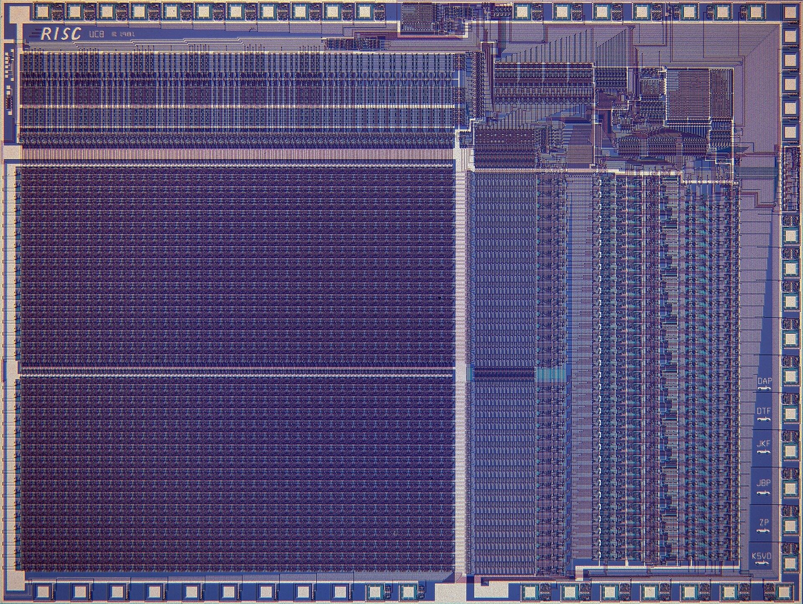
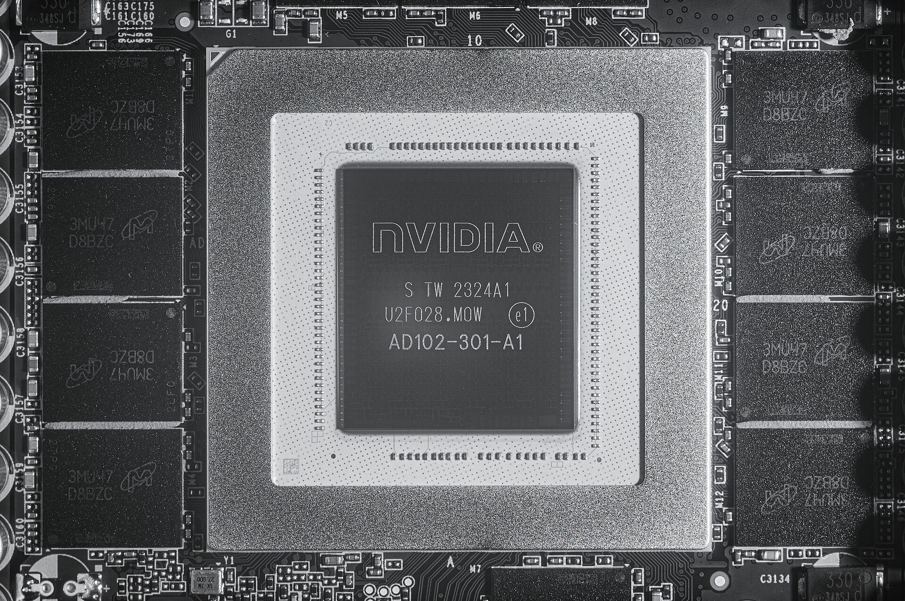
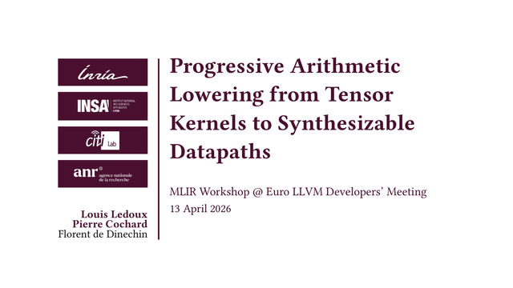

<!-- Draft deck. my_plan.md remains the source for the intended course content. -->

# Orientation {#orientation .section-title .center}

::: {.session-time}
16:00-16:04 | who, why, and where we are going
:::

## Who I am {#who-am-i}

::: {.whoami-layout}
::: {.whoami-portrait}
{fig-alt="Portrait of Louis Ledoux in his workspace"}
:::

::: {.whoami-copy}
::: {.identity-line}
**Louis Ledoux**

Postdoctoral researcher | INSA Lyon + Inria, Emeraude
:::

::: {.identity-thread}
::: {}
**Arithmetic**

floating point, fixed point, approximation
:::
::: {}
**Compilers**

MLIR, CIRCT, HAriCo, FloPoCo
:::
::: {}
**Silicon**

FPGA, ASIC, open EDA, tapeouts
:::
:::

My recurring question is simple: **how much mathematical intent can survive
until the compiler finally commits to wires and registers?**
:::
:::

::: {.source-strip}
[Biography and projects](https://bynaryman.github.io/) | PhD at BSC/UPC; arithmetic-aware compilation at INSA Lyon/Inria.
:::

::: {.notes}
Keep this to one minute. The useful personal thread is not a list of projects:
it is the path from numerical representation, through compiler IR, to actual
silicon. That is also the structure of the session.
:::

## Roadmap {#roadmap}

::: {.content-visible when-profile="student"}
::: {.edition-banner .student-edition}
Student edition | exercises included, solutions withheld
:::
:::

::: {.content-visible when-profile="instructor"}
::: {.edition-banner .instructor-edition}
Instructor edition | private linked solution appendix
:::
:::

::: {.roadmap-grid}
::: {.roadmap-stop}
[**1 | Motivation**](#motivation)

Why application-specific arithmetic changes hardware.
:::
::: {.roadmap-stop}
[**2 | CIRCT**](#circt)

How dialects preserve different design decisions.
:::
::: {.roadmap-stop}
[**3 | E4M3**](#e4m3)

Turn one floating-point island into bit-vector structure.
:::
::: {.roadmap-stop}
[**4 | Hands-on**](#hands-on)

Decode, multiply, normalize, and pack.
:::
::: {.roadmap-stop}
[**5 | HLS**](#hls)

Move from one datapath to scheduling and control.
:::
::: {.roadmap-stop}
[**6 | Conclusion**](#conclusion)

Reassemble the application-to-silicon story.
:::
:::

::: {.navigation-note}
The menu also exposes every slide; these six links jump to the main sections.
:::

# The machine is the output {#motivation .section-title .center}

::: {.session-time}
16:00-16:25 | motivation and digital-design vocabulary
:::

## One computation, two outcomes {auto-animate=true}

::: {.concept-pair}
::: {.concept-side data-id="software-side"}
::: {.panel-title}
Compile for a machine
:::

```mlir
func.func @add(%a: i8, %b: i8) -> i8 {
  %sum = arith.addi %a, %b : i8
  return %sum : i8
}
```

The result is **instructions** executed by hardware that already exists.
:::

::: {.concept-arrow}
→
:::

::: {.concept-side .hardware data-id="hardware-side"}
::: {.panel-title}
Compile the machine
:::

```mlir
hw.module @add(in %a: i8, in %b: i8,
               out result: i8) {
  %sum = comb.add %a, %b : i8
  hw.output %sum : i8
}
```

The result is **structure** that can become hardware.
:::
:::

::: {.thesis-line}
A hardware compiler does not merely choose where an addition runs. It chooses
what the adder is.
:::

::: {.notes}
Open with the question rather than a CIRCT definition. Ask the audience which
side is “lower level.” The useful answer is that they commit to different
semantics, not simply different syntax.
:::

## The computer-science stack reaches silicon

::: {.stack-layout}
::: {.system-stack}
::: {.stack-layer .fragment}
**Application**

language model, vision, DSP
:::
::: {.stack-layer .fragment}
**Algorithm**

matrix multiply, convolution, filter
:::
::: {.stack-layer .fragment}
**Arithmetic**

FP32, BF16, FP8, fixed point
:::
::: {.stack-layer .fragment}
**Compiler IR**

MLIR and CIRCT dialects
:::
::: {.stack-layer .fragment}
**RTL**

modules, wires, registers, cycles
:::
::: {.stack-layer .fragment}
**Logic**

gates, muxes, memories
:::
::: {.stack-layer .fragment}
**Silicon**

placed cells and routed wires
:::
:::

::: {.stack-question}
**The design question**

At which layer should an application-specific arithmetic choice become an
explicit circuit?
:::
:::

## A chip is a map of repeated decisions

::: {.photo-stage}
{fig-alt="Color die photograph of the Berkeley RISC-I processor showing repeated arrays, routing, and the pad ring"}

::: {.photo-caption}
Berkeley RISC-I die, 1981. Regular arrays, distinct regions, routing, and the
I/O ring are visible before we read a single line of RTL.
:::
:::

::: {.source-strip}
Image: [RISC-I Gold die shot, Wikimedia Commons](https://commons.wikimedia.org/wiki/File:RISC-I_Gold_die_shot.jpg), public domain.
:::

::: {.notes}
The anecdote is the visual continuity: the source program has names and types;
the die has repeated physical regions. The compiler is responsible for
preserving meaning while making those physical commitments explicit.
:::

## Specialization starts above the RTL

::: {.metric-layout}
::: {.photo-stage .contain}
{fig-alt="NVIDIA AD102 processor package surrounded by memory devices"}

::: {.photo-caption}
An accelerator is arithmetic, storage, communication, packaging, and software
working as one system.
:::
:::

::: {.decision-chain}
::: {.decision-row .fragment}
**Workload**

Which operations dominate useful work?
:::
::: {.decision-row .fragment}
**Format**

How much range and precision does that workload need?
:::
::: {.decision-row .fragment}
**Datapath**

How many bits, operators, stages, and copies should exist?
:::
::: {.decision-row .fragment}
**System**

How do compute and memory remain fed?
:::
:::
:::

::: {.source-strip}
Image: Fritzchens Fritz, [NVIDIA AD102 package](https://commons.wikimedia.org/wiki/File:Nvidia@5nm@AdaLovelace@AD102@GeForce_RTX_4090@S_TW_2324A1_U2F028.MOW_AD102-301-A1_DSCx5@IR.jpg), CC0.
:::

## A useful historical scale

::: {.metric-layout}
::: {}
::: {.metric-number}
65,536
:::

::: {.metric-caption}
8-bit multiply-accumulate cells in the original TPU matrix unit
:::
:::

::: {}
The TPU paper describes a **256 × 256** matrix unit performing signed or
unsigned 8-bit products and accumulating into wider state.

The application did not ask for a general CPU instruction. It motivated a
large, regular arithmetic machine.
:::
:::

::: {.source-strip}
Source: Jouppi et al., [In-Datacenter Performance Analysis of a Tensor Processing Unit](https://arxiv.org/abs/1704.04760), ISCA 2017.
:::

::: {.notes}
Keep “65,536” in the audience’s memory. It returns when all possible pairs of
8-bit E4M3 operands are counted. The same number can describe parallel
arithmetic units or table entries, but those are radically different hardware
structures.
:::

## Combinational and sequential are different promises

::: {.columns}
::: {.column width="48%"}
::: {.panel-title}
`comb`: a path through logic
:::

```mlir
%sum = comb.add %a, %b : i8
%pick = comb.mux %sel, %sum, %a : i8
```

No stored state. A change propagates from operands to result.
:::

::: {.column width="48%"}
::: {.panel-title}
`seq`: a value crosses time
:::

```mlir
%next = comb.add %state, %step : i8
%state = seq.compreg %next, %clk : i8
```

A register stores a value and introduces a cycle boundary.
:::
:::

::: {.callout-note}
This tutorial builds one combinational datapath. Scheduling and register
placement return at the end as the bridge to HLS.
:::

## The multi-stage prism {auto-animate=true}

::: {.lowering-flow data-id="prism-flow"}
::: {.flow-level .source data-id="prism-behavior"}
**Meaning**

`func` + `arith`
:::
::: {.flow-level .transform data-id="prism-structure"}
**Structure**

dataflow + arithmetic
:::
::: {.flow-level .hardware data-id="prism-rtl"}
**Hardware**

`hw` + `comb` + `seq`
:::
::: {.flow-level .output data-id="prism-output"}
**Implementation**

SystemVerilog → silicon
:::
:::

::: {.callout-important}
Each representation exposes the decisions needed by a family of
transformations. No single IR should pretend every decision has already been
made.
:::

# MLIR for hardware: CIRCT {#circt .section-title .center}

::: {.session-time}
16:25-16:45 | representations and one toolchain loop
:::

## Dialects name design levels

| Design concern | IR vocabulary |
|---|---|
| generic computation | `func`, `arith`, `scf`, `cf` |
| modules, ports, hierarchy | `hw` |
| bit-vector combinational logic | `comb` |
| registers and clocks | `seq` |
| dynamic dataflow | `handshake`, `dc` |
| SystemVerilog constructs | `sv` |

::: {.callout-note}
Mixing dialects is expected. A pass can lower one concern while preserving the
others at their useful abstraction level.
:::

::: {.source-strip}
Source: [CIRCT dialect documentation](https://circt.llvm.org/docs/Dialects/) and [HW dialect rationale](https://circt.llvm.org/docs/Dialects/HW/RationaleHW/).
:::

## One adder, three useful views

::: {.view-trio}
::: {}
::: {.panel-title}
Intent
:::

```mlir
%sum = arith.addi %a, %b : i8
```

An integer value is computed.
:::

::: {}
::: {.panel-title}
Circuit IR
:::

```mlir
%sum = comb.add %a, %b : i8
```

An 8-bit combinational operator exists.
:::

::: {}
::: {.panel-title}
Emission
:::

```systemverilog
assign sum = a + b;
```

A hardware description is produced.
:::
:::

::: {.narrative-question}
Same `+`, different contract.
:::

## A `comb` operation is not a CPU instruction

::: {.hardware-quote}
Each operation generally corresponds to hardware that exists, rather than an
instruction executed later by an imperative processor.
:::

::: {.columns}
::: {.column width="48%"}
**Software instinct**

Reuse an execution unit over time.
:::
::: {.column width="48%"}
**Structural default**

Two operations describe two pieces of hardware until another transformation
shares or schedules them.
:::
:::

::: {.source-strip}
Paraphrased from the official [CIRCT `comb` dialect rationale](https://circt.llvm.org/docs/Dialects/Comb/RationaleComb/).
:::

## Keep one loop from the Sam/Louis tutorial

::: {.tool-loop}
::: {.tool-step}
`circt-verilog`

<small>SystemVerilog → `hw` + `comb`</small>
:::
::: {.tool-step}
`circt-opt`

<small>inspect and transform IR</small>
:::
::: {.tool-step}
`circt-lec`

<small>check logical equivalence</small>
:::
::: {.tool-step}
`firtool`

<small>emit SystemVerilog</small>
:::
:::

::: {.source-strip}
Adapted from [Sam Coward and Louis Ledoux, CIRCT_TUTORIAL_2026](https://github.com/cowardsa/CIRCT_TUTORIAL_2026).
:::

## Four commands, one evidence chain

```bash
circt-verilog fma.sv -o fma.mlir

circt-opt fma.mlir \
  --comb-int-range-narrowing --canonicalize \
  -o fma-opt.mlir

circt-lec --c1 fma fma.mlir --c2 fma fma-opt.mlir

firtool fma-opt.mlir -o fma-generated.sv
```

::: {.callout-important}
Import, transform, verify, emit. The hands-on exercise moves inside the second
step and implements one transformation.
:::

## Equivalence closes the optimization loop

::: {.concept-pair}
::: {.concept-side}
::: {.panel-title}
Before
:::

Clear, direct arithmetic structure
:::
::: {.concept-arrow}
≡
:::
::: {.concept-side .hardware}
::: {.panel-title}
After
:::

Narrowed or canonicalized hardware structure
:::
:::

`circt-lec` accepts HW, Comb, and Seq modules and constructs a logical
equivalence problem for the selected pair.

::: {.source-strip}
Source: [CIRCT logical equivalence checking documentation](https://circt.llvm.org/docs/Tools/circt-lec/).
:::

# Let’s multiply {#e4m3 .section-title .center}

::: {.session-time}
16:45-17:05 | application-specific arithmetic and setup checkpoint
:::

## Why an 8-bit float?

::: {.bit-layout}
::: {.bit-field .sign}
**s**

sign

<small>1 bit</small>
:::
::: {.bit-field .exponent}
**eeee**

range

<small>4 bits</small>
:::
::: {.bit-field .fraction}
**mmm**

precision

<small>3 bits</small>
:::
:::

E4M3 spends four bits on exponent range and three on stored fraction. It was
proposed with E5M2 as an FP8 interchange format for deep-learning workloads.

::: {.anecdote}
The format is already a hardware/software agreement: applications accept less
precision so storage, communication, and arithmetic can become smaller.
:::

::: {.source-strip}
Sources: Micikevicius et al., [FP8 Formats for Deep Learning](https://arxiv.org/abs/2209.05433); [MLIR `Float8E4M3FNType`](https://mlir.llvm.org/docs/Dialects/Builtin/#float8e4m3fntype).
:::

## 65,536 ways to multiply

::: {.metric-layout}
::: {}
::: {.metric-number}
256²
:::

::: {.metric-caption}
all possible ordered pairs of two packed 8-bit operands
:::
:::

::: {.decision-chain}
::: {.decision-row .fragment}
**Lookup table**

65,536 entries × 8 result bits before implementation overhead
:::
::: {.decision-row .fragment}
**Datapath**

field extraction, XOR, integer multiply, exponent arithmetic, mux, concat
:::
::: {.decision-row .fragment}
**Question**

Which structure exposes the arithmetic we want to teach and optimize?
:::
:::
:::

::: {.anecdote}
Coincidence with a point: 65,536 is also the number of MAC cells in the original
TPU. A count does not define an architecture; structure does.
:::

## The generic integer mapping stops here

::: {.columns}
::: {.column width="48%"}
::: {.panel-title}
Direct bit-vector mapping
:::

```mlir
%p = arith.muli %a, %b : i8
```

can become

```mlir
%p = comb.mul %a, %b : i8
```
:::

::: {.column width="48%"}
::: {.panel-title}
Floating-point semantics
:::

```mlir
%p = arith.mulf %a, %b : f8E4M3FN
```

needs field decoding, exponent bias, normalization, rounding, and exceptional
value policy.
:::
:::

::: {.callout-warning}
`comb.mul` multiplies bit vectors. It does not silently inherit floating-point
semantics.
:::

## Put the float inside an integer boundary

::: {.island-layout}
::: {.island-graph}
::: {.island-node style="grid-column: 1; grid-row: 1;"}
`%lhs : i8`
:::
::: {.island-arrow style="grid-column: 2; grid-row: 1;"}
→
:::
::: {.island-node .float style="grid-column: 3; grid-row: 1;"}
`bitcast` → `f8`
:::
::: {.island-arrow style="grid-column: 4; grid-row: 1 / 3;"}
→
:::
::: {.island-node style="grid-column: 1; grid-row: 2;"}
`%rhs : i8`
:::
::: {.island-arrow style="grid-column: 2; grid-row: 2;"}
→
:::
::: {.island-node .float style="grid-column: 3; grid-row: 2;"}
`bitcast` → `f8`
:::
::: {.island-node .float style="grid-column: 5; grid-row: 1 / 3;"}
`arith.mulf`
:::
:::

```mlir
%af = arith.bitcast %lhs : i8 to f8E4M3FN
%bf = arith.bitcast %rhs : i8 to f8E4M3FN
%pf = arith.mulf %af, %bf : f8E4M3FN
%p  = arith.bitcast %pf : f8E4M3FN to i8
```
:::

The `hw.module` ports stay packed `i8`. The pass replaces the complete floating
point island with an integer `comb` network.

## Match the boundary, not the headline operation

```cpp
class LowerE4M3FNMulPattern
    : public OpRewritePattern<arith::BitcastOp> {
  LogicalResult matchAndRewrite(
      arith::BitcastOp outputCast,
      PatternRewriter &rewriter) const override;
};
```

::: {.columns}
::: {.column width="48%"}
**Why not root at `mulf`?**

It produces `f8E4M3FN`, while the new network produces `i8`.
:::
::: {.column width="48%"}
**Why root at the output bitcast?**

The old and new subgraphs both cross the boundary as `i8 → i8`.
:::
:::

::: {.anecdote}
The semantically interesting operation is not always the best rewrite root.
Types at the replacement boundary decide what can be replaced directly.
:::

::: {.source-strip}
Pattern API: [MLIR Pattern Rewriting](https://mlir.llvm.org/docs/PatternRewriter/).
:::

## A small optimizer, not a CIRCT rebuild

::: {.project-map}
::: {.project-unit}
**Student project**

`circt-tutorial-opt`

`TutorialTransforms`

one C++ source file
:::
::: {.project-arrow}
links to
:::
::: {.project-unit .runtime}
**Installed CIRCT**

headers

shared libraries

CMake packages + tools
:::
:::

```text
tutorial/
├── lib/LowerE4M3FNToComb.cpp   ← edit here
├── tools/circt-tutorial-opt/
├── examples/e4m3fn-mul.mlir
└── Dockerfile
```

## Setup checkpoint

::: {.exercise-minute}
5 minutes | build, test, pair up
:::

::: {.checkpoint-command}
```bash
docker run -it ghcr.io/bynaryman/mlir-summer-school-2026-circt:latest

./scripts/build.sh
```
:::

::: {.callout-important}
At 17:05, everyone starts from a known-good build. Editor integration may wait;
the exercise may not.
:::

::: {.notes}
As in the Sam/Louis tutorial, the image contains the tools and exercise files;
students do not install a compiler toolchain on their machines.
:::

# Hands-on: one E4M3 datapath {#hands-on .section-title .center}

::: {.session-time}
17:05-17:54 | implement, reveal, verify
:::

## Read the starter from its boundary inward

::: {.columns}
::: {.column width="52%"}
```cpp
auto mul = outputCast.getIn()
               .getDefiningOp<arith::MulFOp>();

auto lhsCast = mul.getLhs()
                   .getDefiningOp<arith::BitcastOp>();
auto rhsCast = mul.getRhs()
                   .getDefiningOp<arith::BitcastOp>();

Value result = buildE4M3FNMultiplier(
    rewriter, outputCast.getLoc(),
    lhsCast.getIn(), rhsCast.getIn());

rewriter.replaceOp(outputCast, result);
```
:::

::: {.column width="44%"}
The starter already:

::: {.incremental}
1. guards the `i8` and E4M3 types;
2. finds both input bitcasts;
3. builds a sign-only placeholder;
4. replaces the outer cast;
5. erases the dead float island.
:::
:::
:::

## State the arithmetic contract before coding

::: {.bit-layout}
::: {.bit-field .sign}
**s**

bit 7
:::
::: {.bit-field .exponent}
**eeee**

bits 6..3, bias 7
:::
::: {.bit-field .fraction}
**mmm**

bits 2..0
:::
:::

::: {.columns}
::: {.column width="48%"}
**Core exercise**

- normal, finite, non-zero operands;
- implicit leading `1`;
- truncation after normalization.
:::
::: {.column width="48%"}
**Stretch only**

- zero and subnormal handling;
- NaNs, overflow, and underflow;
- round-to-nearest, ties-to-even.
:::
:::

::: {.callout-warning}
Passing the core tests does not implement complete `f8E4M3FN` semantics.
:::

## Exercise A: decode and prepare {#exercise-a}

::: {.exercise-minute}
6 minutes | stop at 17:23
:::

::: {.exercise-band}
**Decode**

Extract sign bit 7, exponent bits 6..3, and fraction bits 2..0 from each `i8`.
:::
::: {.exercise-band}
**Prepare**

Prepend the hidden `1` to each 3-bit fraction, then zero-extend both 4-bit
significands to 8 bits.
:::
::: {.exercise-band}
**Check**

The sign path is `sa XOR sb`; both multiplier inputs are now `i8`.
:::

::: {.content-visible when-profile="instructor"}
::: {.exercise-actions}
[Open solution A](#solution-a){.jump-link .solution-jump}
:::
:::

## Exercise B: multiply and combine exponents {#exercise-b}

::: {.exercise-minute}
8 minutes | stop at 17:34
:::

::: {.exercise-band}
**Significand**

Multiply the two zero-extended significands. A 4 × 4 product needs 8 bits.
:::
::: {.exercise-band}
**Exponent**

Zero-extend both 4-bit exponents to 5 bits, add them, then subtract bias 7 once.
:::
::: {.exercise-band}
**Invariant**

Do not normalize yet. Keep the raw product and base exponent as separate SSA
values.
:::

::: {.content-visible when-profile="instructor"}
::: {.exercise-actions}
[Open solution B](#solution-b){.jump-link .solution-jump}
:::
:::

## Exercise C: normalize and pack {#exercise-c}

::: {.exercise-minute}
9 minutes | stop editing at 17:46
:::

::: {.exercise-band}
**Detect**

Product bit 7 distinguishes `[2, 4)` from `[1, 2)`.
:::
::: {.exercise-band}
**Select**

Choose product bits 7..4 when normalizing, otherwise bits 6..3.
:::
::: {.exercise-band}
**Add one**

Zero-extend the normalization bit and add it to the base exponent.
:::
::: {.exercise-band}
**Pack**

Drop the hidden bit and concatenate sign, 4-bit exponent, and 3-bit fraction.
:::

::: {.content-visible when-profile="instructor"}
::: {.exercise-actions}
[Open animated solution](#solution-c){.jump-link .solution-jump}
:::
:::

## Check meaning before admiring structure {#check-meaning}

::: {.test-vector}
::: {}
`1.0 × 1.0`

`0x38 × 0x38 → 0x38`

no normalization increment
:::
::: {}
`1.5 × 1.5`

`0x3c × 0x3c → 0x41`

select shifted product; exponent +1
:::
::: {}
`−1.0 × 1.0`

`0xb8 × 0x38 → 0xb8`

sign path only
:::
:::

```bash
build/bin/circt-tutorial-opt examples/e4m3fn-mul.mlir \
  --lower-e4m3fn-to-comb --canonicalize \
  -o lowered.mlir

./scripts/test-e4m3-all.py
```

::: {.callout-warning}
The timed exercise covers a restricted teaching contract. The exhaustive test
requires the complete E4M3FN solution, including special values and rounding.
:::

## Rewrite cleanup is part of the result

```cpp
rewriter.replaceOp(outputCast, result);

if (mul->use_empty())
  rewriter.eraseOp(mul);

if (lhsCast == rhsCast) {
  if (lhsCast->use_empty())
    rewriter.eraseOp(lhsCast);
} else {
  if (lhsCast->use_empty()) rewriter.eraseOp(lhsCast);
  if (rhsCast->use_empty()) rewriter.eraseOp(rhsCast);
}
```

::: {.anecdote}
The `%x × %x` test found a real ownership bug: both operands may share one
bitcast. Erasing “left” and then “right” would erase the same operation twice.
:::

All mutations go through `PatternRewriter`, and dead producers are erased in
reverse dataflow order.

# Beyond one datapath {#hls .section-title .center}

::: {.session-time}
17:54-18:00 | progressive lowering, scheduling, and HLS
:::

## Arithmetic lowering is not HLS {#arithmetic-vs-hls}

::: {.columns}
::: {.column width="48%"}
::: {.panel-title}
What we built
:::

```text
one expression
  → one combinational datapath
```

The operators all exist at once. The pass chooses their bit widths, topology,
and arithmetic meaning.
:::

::: {.column width="48%"}
::: {.panel-title}
What HLS must additionally decide
:::

::: {.incremental}
- which cycle starts each operation;
- which operations share a hardware unit;
- where registers and buffers are inserted;
- how loops, branches, and memory communicate.
:::
:::
:::

::: {.thesis-line}
Arithmetic lowering answers **what circuit computes**. HLS also answers
**when the circuit computes**.
:::

## One rung of the EuroLLVM 2026 flow {#eurollvm-2026-flow}

::: {.workshop-bridge}
::: {.workshop-cover}
{fig-alt="Title of the EuroLLVM 2026 MLIR Workshop presentation Progressive Arithmetic Lowering from Tensor Kernels to Synthesizable Datapaths"}
:::

::: {.progressive-flow}
::: {.progressive-stage .application}
**Application**

PyTorch · Faust · C++
:::
::: {.progressive-stage .meaning}
**Mathematical intent**

tensor · `real_arith`
:::
::: {.progressive-stage .number}
**Machine arithmetic**

`arith` · fixed/float
:::
::: {.progressive-stage .circuit}
**Datapaths**

HAriCo · `comb`
:::
::: {.progressive-stage .time}
**Time**

HLS · `seq`
:::
::: {.progressive-stage .silicon}
**Implementation**

RTL · GDS
:::
:::
:::

::: {.workshop-takeaway}
Our E4M3 pass occupies one deliberate boundary: **machine arithmetic → explicit
datapath**. It does not replace the front end, HLS, or physical design.
:::

::: {.source-strip}
Adapted from Ledoux, Cochard, and de Dinechin, [Progressive Arithmetic Lowering from Tensor Kernels to Synthesizable Datapaths](https://hal.science/hal-05594483/file/slides.pdf), MLIR Workshop at EuroLLVM 2026.
:::

## EuroLLVM 2022: make time explicit {#eurollvm-2022-scheduling}

::: {.schedule-example}
::: {.schedule-code}
```mlir
%x = affine.load %X[%i] : memref<64xi32>
%y = affine.load %Y[%i] : memref<64xi32>
%m = arith.muli %x, %y : i32
%s = arith.addi %sum, %m : i32
```

The SSA graph states dependencies, but it has no cycle numbers.
:::

::: {.schedule-timeline}
::: {.cycle-label}
cycle
:::
::: {.cycle-number}
0
:::
::: {.cycle-number}
1
:::
::: {.cycle-number}
2
:::
::: {.cycle-number}
3
:::

::: {.lane-label .memory-lane}
memory
:::
::: {.schedule-slot .load-x}
load X
:::
::: {.schedule-slot .load-y}
load Y
:::

::: {.lane-label .multiply-lane}
multiply
:::
::: {.schedule-slot .multiply-slot}
multiply · latency 2
:::

::: {.lane-label .add-lane}
add
:::
::: {.schedule-slot .add-slot}
add
:::
:::
:::

::: {.narrative-question}
When may each unit start, and how soon may the next loop iteration start?
:::

::: {.source-strip}
Example adapted from Oppermann, Urbach, and Demme, [How to Make Hardware with Maths](https://llvm.org/devmtg/2022-05/slides/2022EuroLLVM-HowtoMakeHardwarewithMaths.pdf), EuroLLVM 2022 ([video](https://www.youtube.com/watch?v=tctEk7O5DU0)).
:::

## A scheduling problem is a contract {#scheduling-contract}

::: {.scheduling-contract}
::: {.contract-part}
**Operations**

loads, multiply, add
:::
::: {.contract-part}
**Dependences**

SSA edges + loop-carried edges
:::
::: {.contract-part}
**Operator library**

latency, resource count, delay
:::
::: {.contract-part .contract-solution}
**Solution**

start times + initiation interval
:::
:::

::: {.schedule-equation}
`start(i) + latency(i) ≤ start(j) + distance(i,j) × II`
:::

The problem model states constraints independently of the scheduler. A client
can choose an algorithm while preserving one verifiable contract.

::: {.source-strip}
Sources: [CIRCT static scheduling infrastructure](https://circt.llvm.org/docs/Scheduling/) and the [SSP dialect rationale](https://circt.llvm.org/docs/Dialects/SSP/RationaleSSP/).
:::

## Two HLS paths through CIRCT {#hls-paths}

::: {.hls-choice-flow}
::: {.hls-source-node}
**Untimed program**

`func` · `arith` · `scf`
:::

::: {.hls-branch .static-hls}
**Static scheduling**

compile-time start times

FSM + datapath
:::

::: {.hls-branch .dynamic-hls}
**Dynamic scheduling**

tokens + backpressure

Handshake network
:::

::: {.hls-target-node}
**Hardware dialects**

`hw` · `comb` · `seq`

SystemVerilog
:::
:::

`hlstool` composes complete experimental HLS pipelines. `circt-opt` remains the
microscope for inspecting one representation change at a time.

::: {.source-strip}
Sources: [HLS in CIRCT](https://circt.llvm.org/docs/HLS/), [Handshake](https://circt.llvm.org/docs/Dialects/Handshake/), and [static scheduling](https://circt.llvm.org/docs/Scheduling/).
:::

# Conclusion {#conclusion .section-title .center}

::: {.session-time}
18:00 | one story, six decisions
:::

## Reconstruct the story {#reconstruct-story}

::: {.closing-flow}
::: {}
**Application**

chooses useful arithmetic
:::
::: {}
**Semantics**

chooses representation
:::
::: {}
**CIRCT**

chooses circuit structure
:::
::: {}
**HLS + backend**

choose time and implementation
:::
:::

::: {.thesis-line}
A hardware compiler turns application meaning into an explicit machine, one
defensible representation change at a time.
:::

## What to keep {#takeaways}

::: {.takeaway-grid}
::: {.takeaway-item}
**1 | IR is a contract**

Each dialect preserves the decisions that remain legal.
:::
::: {.takeaway-item}
**2 | Types are architecture**

E4M3 is not merely a storage format once it becomes a datapath.
:::
::: {.takeaway-item}
**3 | Boundaries simplify rewrites**

The outer bitcast turns a floating-point island into an `i8 → i8` replacement.
:::
::: {.takeaway-item}
**4 | Verification belongs in the loop**

IR checks, representative vectors, equivalence, and RTL all test different claims.
:::
::: {.takeaway-item}
**5 | HLS adds time**

Scheduling and control begin where a combinational arithmetic graph stops.
:::
::: {.takeaway-item}
**6 | Specialization is progressive**

Application intent should survive until the layer that can exploit it.
:::
:::

## Continue after class {#continue}

::: {.continue-paths}
::: {}
**Finish the arithmetic**

round-to-nearest-even, zero, subnormal, overflow, NaN
:::
::: {}
**Strengthen the compiler**

type conversion, broader float islands, generated pass definitions
:::
::: {}
**Add time**

pipeline the multiplier or schedule a loop around it
:::
::: {}
**Close the loop**

formal equivalence, synthesis metrics, and exhaustive E4M3 testing
:::
:::

::: {.callout-note}
The timed exercise intentionally implements normal, finite, non-zero E4M3FN
operands with truncation. The omitted behavior is the next project, not hidden
correctness.
:::

## Sources and material {#sources}

::: {.reference-list}
1. Jouppi et al., [In-Datacenter Performance Analysis of a Tensor Processing Unit](https://arxiv.org/abs/1704.04760), ISCA 2017.
2. Micikevicius et al., [FP8 Formats for Deep Learning](https://arxiv.org/abs/2209.05433), 2022.
3. [MLIR Builtin `Float8E4M3FNType`](https://mlir.llvm.org/docs/Dialects/Builtin/#float8e4m3fntype) and [Pattern Rewriting](https://mlir.llvm.org/docs/PatternRewriter/).
4. [CIRCT dialect documentation](https://circt.llvm.org/docs/Dialects/), including [`comb`](https://circt.llvm.org/docs/Dialects/Comb/), [`hw`](https://circt.llvm.org/docs/Dialects/HW/), and [`handshake`](https://circt.llvm.org/docs/Dialects/Handshake/).
5. [CIRCT HLS](https://circt.llvm.org/docs/HLS/) and [static scheduling](https://circt.llvm.org/docs/Scheduling/).
6. Ledoux, Cochard, and de Dinechin, [Progressive Arithmetic Lowering](https://hal.science/hal-05594483/file/slides.pdf), EuroLLVM 2026.
7. Oppermann, Urbach, and Demme, [How to Make Hardware with Maths](https://llvm.org/devmtg/2022-05/slides/2022EuroLLVM-HowtoMakeHardwarewithMaths.pdf), EuroLLVM 2022.
8. [Sam Coward and Louis Ledoux, CIRCT_TUTORIAL_2026](https://github.com/cowardsa/CIRCT_TUTORIAL_2026).
9. Local exercise: `tutorial/`; image licenses: `assets/images/ATTRIBUTIONS.md`.
:::

::: {.content-visible when-profile="instructor"}
# Instructor solution bank {#solution-bank .section-title .center visibility="uncounted"}

::: {.session-time}
Private appendix | linked from Exercises A, B, and C
:::

## Solution A: packed fields become wires {#solution-a visibility="uncounted"}

::: {.columns}
::: {.column width="50%"}
```mlir
%sa = comb.extract %a from 7 : (i8) -> i1
%ea = comb.extract %a from 3 : (i8) -> i4
%fa = comb.extract %a from 0 : (i8) -> i3

%sb = comb.extract %b from 7 : (i8) -> i1
%eb = comb.extract %b from 3 : (i8) -> i4
%fb = comb.extract %b from 0 : (i8) -> i3
```
:::

::: {.column width="46%"}
```mlir
%one = hw.constant 1 : i1
%ma4 = comb.concat %one, %fa : i1, i3
%mb4 = comb.concat %one, %fb : i1, i3

%zero4 = hw.constant 0 : i4
%ma8 = comb.concat %zero4, %ma4 : i4, i4
%mb8 = comb.concat %zero4, %mb4 : i4, i4
```
:::
:::

::: {.solution-nav}
[Back to Exercise A](#exercise-a){.jump-link .return-jump}
[Continue to Exercise B](#exercise-b){.jump-link .continue-jump}
:::

## Solution B: one graph, two arithmetic paths {#solution-b visibility="uncounted"}

::: {.columns}
::: {.column width="50%"}
```mlir
%product = comb.mul %ma8, %mb8 : i8
```

For normal inputs, each significand is in `[1, 2)`, so the product is in
`[1, 4)`.
:::

::: {.column width="46%"}
```mlir
%zero1 = hw.constant 0 : i1
%ea5 = comb.concat %zero1, %ea : i1, i4
%eb5 = comb.concat %zero1, %eb : i1, i4
%sum = comb.add %ea5, %eb5 : i5
%bias = hw.constant 7 : i5
%base = comb.sub %sum, %bias : i5
```
:::
:::

::: {.narrative-question}
Where can the leading `1` land in the 8-bit product?
:::

::: {.solution-nav}
[Back to Exercise B](#exercise-b){.jump-link .return-jump}
[Continue to Exercise C](#exercise-c){.jump-link .continue-jump}
:::

## Solution C: circuit and `comb` IR unveil together {#solution-c visibility="uncounted"}

::: {.solution-workbench}
::: {.datapath-panel}
```{=html}
<svg class="multiplier-svg" viewBox="0 0 900 560" role="img" aria-label="Incrementally revealed E4M3 multiplier datapath">
  <circle class="port" cx="92" cy="145" r="7" />
  <text class="port-label" x="12" y="151">%a:i8</text>
  <circle class="port" cx="92" cy="415" r="7" />
  <text class="port-label" x="12" y="421">%b:i8</text>

  <g class="fragment" data-fragment-index="0">
    <text class="stage-tag unpack" x="175" y="42">1 · unpack</text>
    <path class="stage-wire unpack" d="M99 145 H108" />
    <path class="stage-wire unpack" d="M99 415 H108" />
    <rect class="node unpack" x="108" y="75" width="135" height="140" rx="4" />
    <text class="node-label" x="175" y="112">extract A</text>
    <text class="node-detail" x="175" y="143">s = [7]</text>
    <text class="node-detail" x="175" y="168">e = [6:3]</text>
    <text class="node-detail" x="175" y="193">f = [2:0]</text>
    <rect class="node unpack" x="108" y="345" width="135" height="140" rx="4" />
    <text class="node-label" x="175" y="382">extract B</text>
    <text class="node-detail" x="175" y="413">s = [7]</text>
    <text class="node-detail" x="175" y="438">e = [6:3]</text>
    <text class="node-detail" x="175" y="463">f = [2:0]</text>
  </g>

  <g class="fragment" data-fragment-index="1">
    <text class="stage-tag prepare" x="338" y="42">2 · prepare</text>
    <path class="stage-wire prepare" d="M243 118 H278 V100 H302" />
    <path class="stage-wire prepare" d="M243 388 H278 V122 H302" />
    <path class="stage-wire prepare" d="M243 188 H302" />
    <path class="stage-wire prepare" d="M243 458 H278 V360 H302" />
    <rect class="node prepare" x="302" y="70" width="110" height="65" rx="4" />
    <text class="node-label" x="357" y="100">XOR</text>
    <text class="node-detail" x="357" y="122">result sign</text>
    <rect class="node prepare" x="302" y="165" width="110" height="72" rx="4" />
    <text class="node-label" x="357" y="195">{1, fa}</text>
    <text class="node-detail" x="357" y="220">extend to i8</text>
    <rect class="node prepare" x="302" y="325" width="110" height="72" rx="4" />
    <text class="node-label" x="357" y="355">{1, fb}</text>
    <text class="node-detail" x="357" y="380">extend to i8</text>
  </g>

  <g class="fragment" data-fragment-index="2">
    <text class="stage-tag multiply" x="520" y="42">3 · multiply</text>
    <path class="stage-wire multiply" d="M243 158 H438 V120 H460" />
    <path class="stage-wire multiply" d="M243 428 H438 V150 H460" />
    <path class="stage-wire multiply" d="M412 200 H438 V270 H460" />
    <path class="stage-wire multiply" d="M412 360 H438 V315 H460" />
    <rect class="node multiply" x="460" y="88" width="130" height="88" rx="4" />
    <text class="node-label" x="525" y="120">exp add</text>
    <text class="node-detail" x="525" y="145">ea + eb − 7</text>
    <rect class="node multiply" x="460" y="245" width="130" height="95" rx="4" />
    <text class="node-label" x="525" y="282">comb.mul</text>
    <text class="node-detail" x="525" y="310">i8 product</text>
  </g>

  <g class="fragment" data-fragment-index="3">
    <text class="stage-tag normalize" x="690" y="42">4 · normalize</text>
    <path class="stage-wire normalize" d="M590 132 H630 V125 H646" />
    <path class="stage-wire normalize" d="M590 292 H620 V280 H646" />
    <path class="stage-wire normalize" d="M720 232 V178" />
    <rect class="node normalize" x="646" y="88" width="148" height="90" rx="4" />
    <text class="node-label" x="720" y="120">exp + norm</text>
    <text class="node-detail" x="720" y="147">increment if bit 7</text>
    <rect class="node normalize" x="646" y="232" width="148" height="110" rx="4" />
    <text class="node-label" x="720" y="268">bit 7 + mux</text>
    <text class="node-detail" x="720" y="295">[7:4] or [6:3]</text>
    <text class="node-detail" x="720" y="320">normalized i4</text>
  </g>

  <g class="fragment" data-fragment-index="4">
    <text class="stage-tag pack" x="842" y="42">5 · pack</text>
    <path class="stage-wire pack" d="M412 102 H820 V190" />
    <path class="stage-wire pack" d="M794 133 H820 V228" />
    <path class="stage-wire pack" d="M794 287 H820 V267" />
    <rect class="node pack" x="810" y="178" width="70" height="112" rx="4" />
    <text class="node-label" x="845" y="216">concat</text>
    <text class="node-detail" x="845" y="244">s · e · f</text>
    <text class="node-detail" x="845" y="270">i8</text>
    <path class="stage-wire pack" d="M880 234 H892" />
    <circle class="port" cx="892" cy="234" r="7" />
  </g>
</svg>
```
:::

::: {.solution-code-panel}
::: {.solution-code-title}
CIRCT `comb` IR
:::

::: {.solution-waiting}
Packed `i8` operands define the stable replacement boundary.
:::

::: {.solution-code-step .fragment .current-visible data-fragment-index="0"}
::: {.stage-name}
1 · unpack fields
:::
```mlir
%sa = comb.extract %a from 7 : (i8) -> i1
%ea = comb.extract %a from 3 : (i8) -> i4
%fa = comb.extract %a from 0 : (i8) -> i3
%sb = comb.extract %b from 7 : (i8) -> i1
%eb = comb.extract %b from 3 : (i8) -> i4
%fb = comb.extract %b from 0 : (i8) -> i3
```
:::

::: {.solution-code-step .fragment .current-visible data-fragment-index="1"}
::: {.stage-name}
2 · sign and hidden bits
:::
```mlir
%sign = comb.xor %sa, %sb : i1
%one = hw.constant 1 : i1
%ma4 = comb.concat %one, %fa : i1, i3
%mb4 = comb.concat %one, %fb : i1, i3
%zero4 = hw.constant 0 : i4
%ma8 = comb.concat %zero4, %ma4 : i4, i4
%mb8 = comb.concat %zero4, %mb4 : i4, i4
```
:::

::: {.solution-code-step .fragment .current-visible data-fragment-index="2"}
::: {.stage-name}
3 · significand and exponent paths
:::
```mlir
%product = comb.mul %ma8, %mb8 : i8
%zero1 = hw.constant 0 : i1
%ea5 = comb.concat %zero1, %ea : i1, i4
%eb5 = comb.concat %zero1, %eb : i1, i4
%sum = comb.add %ea5, %eb5 : i5
%bias = hw.constant 7 : i5
%base = comb.sub %sum, %bias : i5
```
:::

::: {.solution-code-step .fragment .current-visible data-fragment-index="3"}
::: {.stage-name}
4 · normalize and add one
:::
```mlir
%norm = comb.extract %product from 7 : (i8) -> i1
%direct = comb.extract %product from 3 : (i8) -> i4
%shifted = comb.extract %product from 4 : (i8) -> i4
%mant = comb.mux %norm, %shifted, %direct : i4
%norm5 = comb.concat %zero4, %norm : i4, i1
%adjusted = comb.add %base, %norm5 : i5
```
:::

::: {.solution-code-step .fragment .current-visible data-fragment-index="4"}
::: {.stage-name}
5 · remove the hidden bit and pack
:::
```mlir
%frac = comb.extract %mant from 0 : (i4) -> i3
%exp = comb.extract %adjusted from 0 : (i5) -> i4
%result = comb.concat %sign, %exp, %frac
    : i1, i4, i3
hw.output %result : i8
```
:::
:::
:::

::: {.notes}
Five advances reveal unpack, prepare, multiply, normalize, and pack. Keep the
pointer on the left diagram; the code pane changes automatically. Emphasize the
normalization bit feeding both the mantissa mux and the exponent increment.
:::


::: {.solution-nav}
[Back to Exercise C](#exercise-c){.jump-link .return-jump}
[Continue to checks](#check-meaning){.jump-link .continue-jump}
:::
:::
