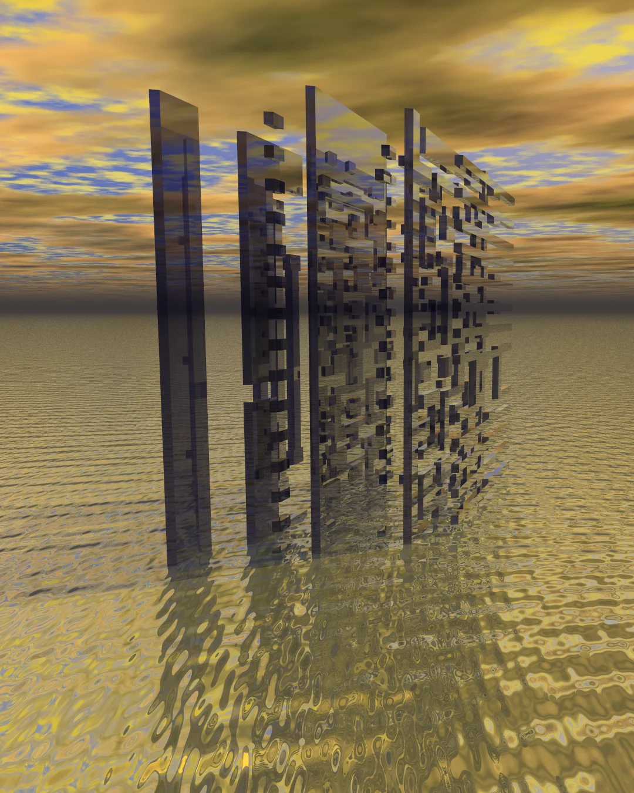
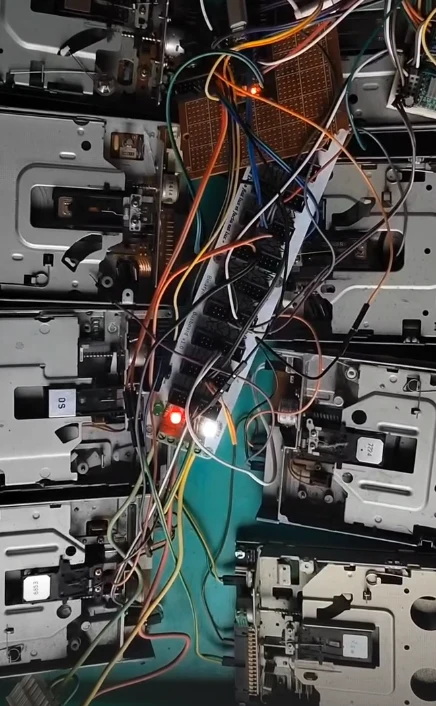
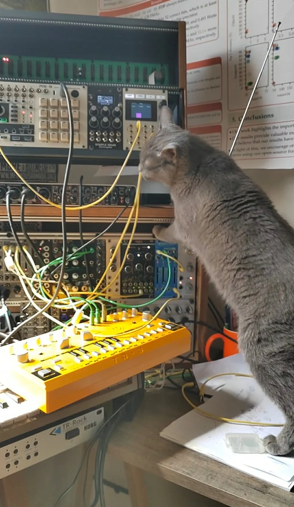
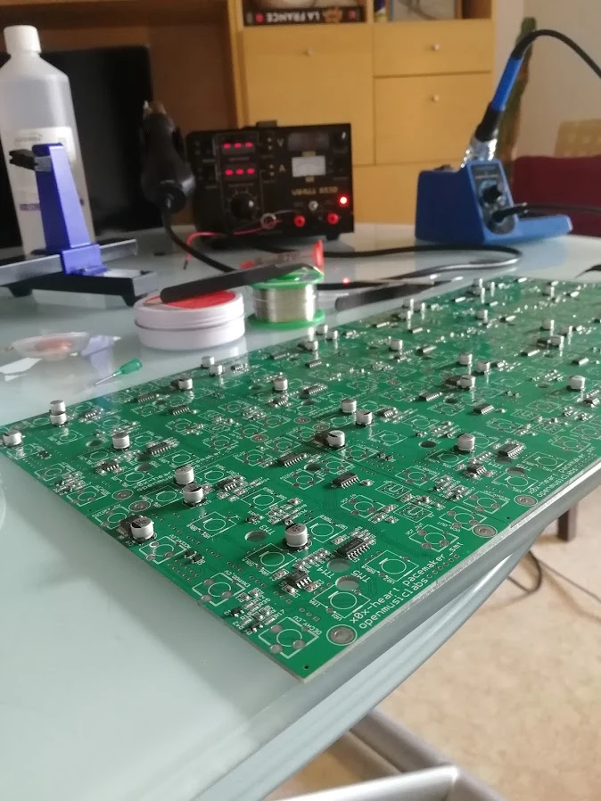
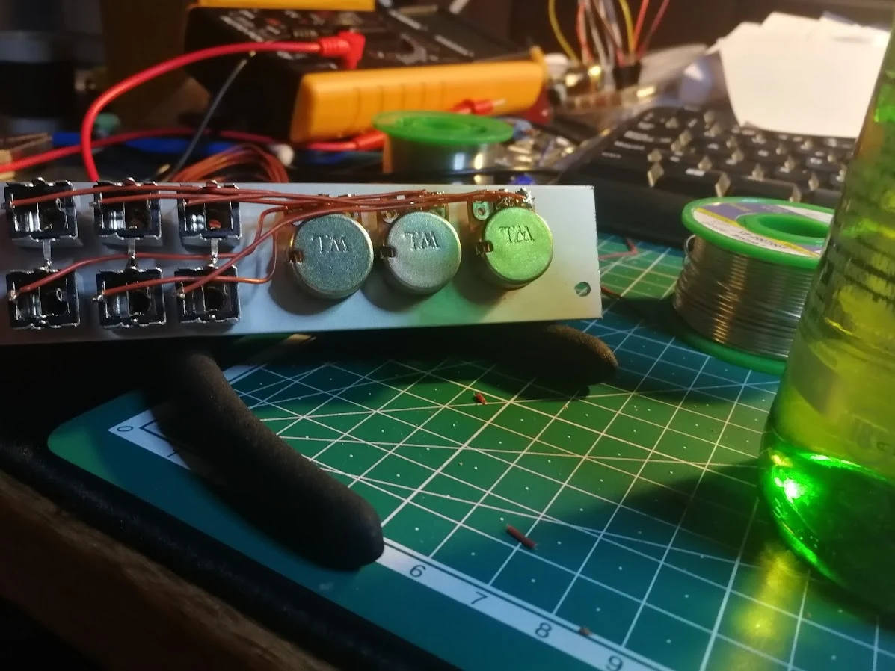
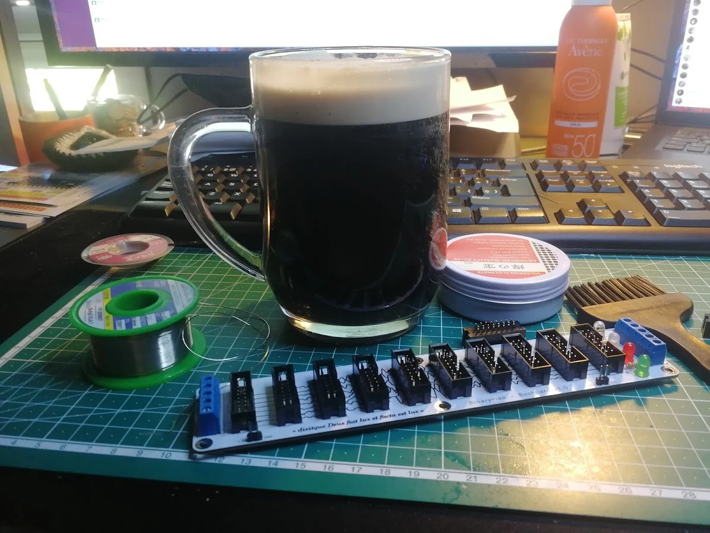

## Course outline {#contents}

::: {.course-toc}
1. [`$ whoami`](#about) [~5 min]{.toc-time}
2. [From problems to electron flow](#motivation) [quiz]{.toc-quiz} [~10 min]{.toc-time}
3. [Digital design primer](#digital-design) [quiz]{.toc-quiz} [~20 min]{.toc-time}
4. [CIRCT: MLIR toward hardware](#circt) [~10 min]{.toc-time}
5. [CIRCT in practice](#circt-tools) [hands-on: 5 exercises]{.toc-hands-on} [quiz]{.toc-quiz} [~45 min]{.toc-time}
6. [Arithmetic becomes hardware](#arithmetic) [hands-on: 3 exercises + 1 optional]{.toc-hands-on} [quiz]{.toc-quiz} [~50 min]{.toc-time}
7. [Bonus: HLS with MLIR and CIRCT](#hls) [~20 min]{.toc-time}
:::

## Before we continue {#download-container}

Start downloading the course image now:

```bash
docker pull ghcr.io/bynaryman/mlir-summer-school-2026-circt:latest
```

It can download while we begin.

# `$ whoami` {#about .section-title .center .whoami-intro}

::: {.whoami-joke-line .fragment}
[Not an MLIR expert]{.marker} ... `:')`
:::

## Louis Ledoux {#whoami}

::: {.whoami-layout}
::: {.whoami-portrait}
{fig-alt="Louis Ledoux with Ada"}
:::

::: {.whoami-copy}
<ul class="whoami-list">
  <li>Postdoctoral researcher at INSA Lyon and Inria, Emeraude.</li>
  <li>I design <span class="marker">arithmetic circuits</span> and circuit generators with MLIR and CIRCT.</li>
  <li>Incoming Associate Professor at University of Rennes, IRISA and Inria, working on <span class="marker">systolic arrays</span> and <span class="marker">small floating-point formats</span>.</li>
</ul>

<div class="whoami-links">More work and links: <a href="https://bynaryman.github.io">bynaryman.github.io</a> · <a href="https://github.com/Bynaryman">github.com/Bynaryman</a></div>
:::
:::

## "ars similis cassus" {#artist}

But also an [artist]{.marker}.

<div class="artist-gallery artist-gallery-captioned artist-gallery-works">
  <figure>
    
    <figcaption>130 nm full adder lost in a 90s CGI infinite ocean.</figcaption>
  </figure>
  <figure>
    
    <figcaption>Retrorchestre: floppy disks go brrr.</figcaption>
  </figure>
  <figure>
    
    <figcaption>Ada and the theremin for random modulation.</figcaption>
  </figure>
</div>

## Electronics {#artist-electronics}

<div class="artist-gallery artist-gallery-wide artist-gallery-captioned">
  <figure>
    
    <figcaption>Isopropyl alcohol</figcaption>
  </figure>
  <figure>
    
    <figcaption>Heineken</figcaption>
  </figure>
  <figure>
    
    <figcaption>Guinness</figcaption>
  </figure>
</div>

# From problems to electron flow {#motivation .section-title .center}



# Digital design primer {#digital-design .section-title .center}



# CIRCT: MLIR toward hardware {#circt .section-title .center}



# CIRCT in practice {#circt-tools .section-title .center}



# Arithmetic becomes hardware {#arithmetic .section-title .center}



## What to keep from this session {#course-takeaways}

- `hw`, `comb`, and `seq` preserve hardware structure, dataflow, and state.

- A lowering is an **architecture choice**: one operation can become many
  circuits.

- Prove behavior first; then compare Boolean structure and physical cost.

- MLIR and CIRCT make that design loop programmable.

[Preserve intent long enough to choose the circuit deliberately.]{.marker}

# Bonus: HLS with MLIR and CIRCT {#hls .section-title .center}



## References {#references .smaller}

::: {#refs}
:::
